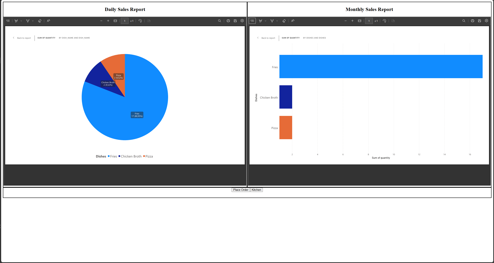
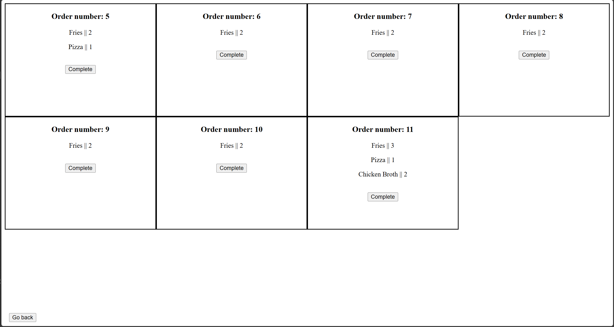
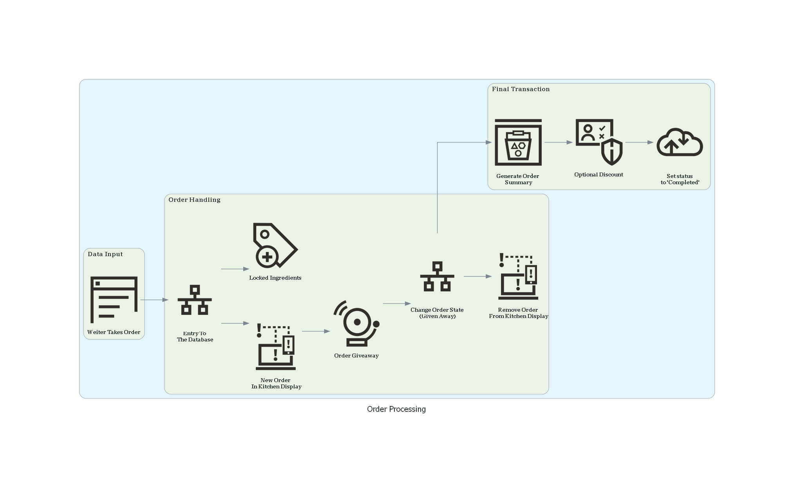

# Restaurant Order Management System (ORM/SQL- Project)

This project simulates a real-world restaurant system using ORM/SQL. It includes core database design, business logic (stored procedures and triggers), and reporting views.

## Features

- Store and manage customers, menu items, and orders
- Track inventory and ingredient usage
- Automate logic with triggers and stored procedures
- Generate useful reports (top-selling items, low stock, etc.)

---

## Database Schema

### Tables

- **Customers** – Stores customer details  

- **Menu_Items** – Menu of available dishes  

- **Orders** – Order headers with customer and timestamp

- **Order_Items** – Order details: which items and how many 

- **Ingredients** – Tracks ingredients in stock

- **Recipe** – Maps menu items to required ingredients

---

## Key SQL Concepts

### Stored Procedures
<!-- - `sp_PlaceOrder(customer_id, item_id, quantity)` – Places a new order and links order items -->
- `sp_RestockIngredient(ingredient_id, quantity)` – Restocks ingredients
- `sp_GenerateSalesReport(date)` – Shows sales data for a given day

### Triggers
- `trg_deduct_stock` – Automatically deducts ingredients when an item is added to an order

### Views
- `vw_specifiedOrder` - Shows details of order with given id
- `vw_TopSellingItems` – Shows top-selling dishes
- `vw_InventoryStatus` – Shows ingredient stock levels and alerts

---
## Web Preview

### Main Page

### Order Making

https://github.com/user-attachments/assets/4b638861-22bb-4f1b-9ebf-ab671159b4e8

### Kitchen View

---

## Event Processing

---
  
## Tech Stack

- SQL/ORM: MySQL/SQLAlchemy
- Backend: FastAPI / Python
- Optional: Simple HTML/CSS/JS frontend 
- Visualization: Graphviz

---

### Database server - XAMPP
